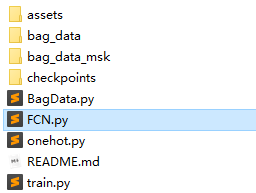
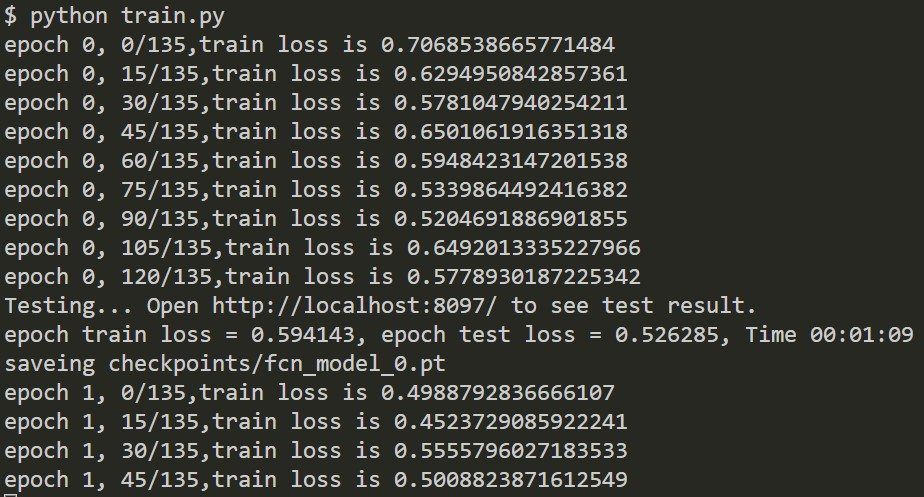
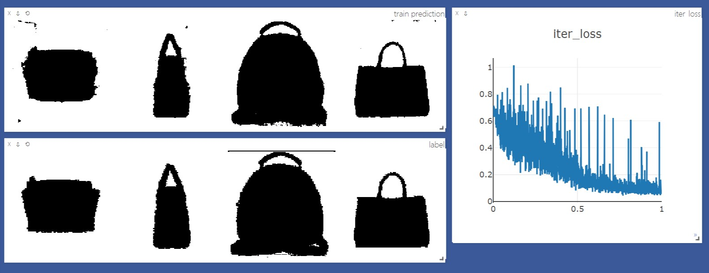

* **吕秀庆 高级计算机视觉课程实验项目**
###  **FCN Semantic Segmentation with PyTorch**

本项目是论文[Fully Convolutional Networks for Semantic Segmentation](http://arxiv.org/abs/1411.4038)的一个pytorch简单复现，数据集很小，是一些随机背景上的一些包的图片（所有数据集大小一共不到80M）

> 关于此数据集详细信息，见[数据集](#数据集)

根据论文实现了FCN32s、FCN16s和FCN8s

### 1. 项目结构



**说明**

**bag_data**和**bag_data_msk**文件夹分别是图片和标注，**checkpoints**用于存放训练模型。

#### 1.1 [train.py](train.py)

* 训练网络与可视化
* 主函数

#### 1.2 [FCN.py](FCN.py)

* FCN32s、FCN16s、FCN8s、FCNs网络定义
* VGGNet网络定义、VGG不同种类网络参数、构建VGG网络的函数

#### 1.3 [BagData.py](BagData.py)

* 定义方便PyTorch读取数据的Dataset和DataLoader
* 定义数据的变换transform

#### 1.4 [onehot.py](onehot.py)

* 图片的onehot编码

### 2. 项目运行

#### 2.1 运行环境

* Windows 10
* CUDA 10.x （可选）
* Anaconda 3 （numpy、os、datetime、matplotlib）
* pytorch == 0.4.1 or 1.0+
* torchvision == 0.2.1
* visdom == 0.1.8.5
* OpenCV-Python == 3.4.1

#### 2.2 运行命令

* 打开终端，输入
```sh
python -m visdom.server
```
* 打开另一终端，输入
```sh
python train.py
```
* 若没有问题可以打开浏览器输入`http://localhost:8097/`来使用`visdom`可视化


### 3. 数据集

* training data来自[这里](https://github.com/yunlongdong/FCN-pytorch-easiest/tree/master/last)，ground-truth来自[这里](https://github.com/yunlongdong/FCN-pytorch-easiest/tree/master/last_msk)。
* 链接中提供的图片中，部分ground-truth的有误，而且部分有ground-truth的图片没有对应training data的图片，将这些有错误的图片分别剔除，重新编号排序之后剩余533张图片。
* 之后我随机选取了67张图片**旋转180度**，一共在training data和ground-truth分别凑够200张图片（0.jpg ~ 199.jpg）。

### 4. 实验结果
#### 4.1 训练



#### 4.2 可视化
* train prediction：训练时模型的输出
* label：ground-truth
* test prediction：预测时模型的输出（每次训练都会预测，但预测数据不参与训练与backprop）
* train iter loss：训练时每一批（batch）的loss情况
* test iter loss：测试时每一批（batch）的loss情况
使用visdom可视化，运行了20个epoch后的可视化如下图：



